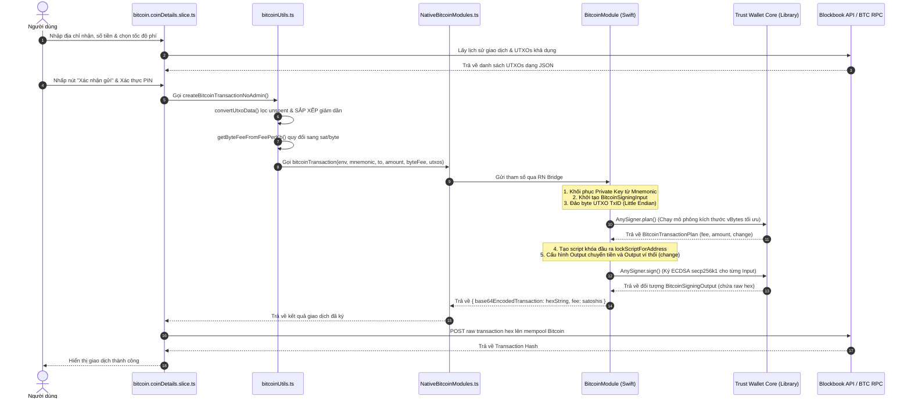

# ĐẶC TẢ KỸ THUẬT VÀ PHÂN TÍCH CHI TIẾT CƠ CHẾ CHUYỂN KHOẢN VÍ BITCOIN (BTC) TRONG CRYPTOVAULT

Tài liệu này tập trung đặc tả chi tiết toàn bộ luồng nghiệp vụ, cơ sở lý thuyết, các tệp nguồn liên quan và phân tích từng hàm (function flow) chịu trách nhiệm cho tính năng **Chuyển khoản ví Bitcoin (BTC)** trong hệ thống CryptoVault.

---

## 1. Nền tảng lý thuyết: Mô hình Bitcoin UTXO và Tính toán Phí giao dịch

Để hiểu cách CryptoVault triển khai chuyển khoản BTC, trước hết phải làm rõ sự khác biệt cốt lõi giữa mô hình UTXO và mô hình tài khoản (Account Model) phổ biến.

```
MÔ HÌNH ACCOUNT (Ethereum, TON,...)           MÔ HÌNH UTXO (Bitcoin)
┌─────────────────────────────────┐           ┌──────────────────────────────────┐
│ Ví A: Số dư 10 ETH              │           │ Ví A: gồm 3 UTXO độc lập:        │
│                                 │           │   - UTXO 1: 0.5 BTC (từ giao dịch X)│
│  (Chuyển 2 ETH sang Ví B)        │           │   - UTXO 2: 0.3 BTC (từ giao dịch Y)│
│                                 │           │   - UTXO 3: 0.4 BTC (từ giao dịch Z)│
│   Ví A = 10 - 2 = 8 ETH         │           │                                  │
│   Ví B = B + 2 ETH              │           │  (Chuyển 0.6 BTC sang Ví B)      │
│                                 │           │   - Input: UTXO 1 + UTXO 2 (0.8) │
│ (Trạng thái số dư cập nhật      │           │   - Output 1: 0.6 BTC (Ví B)      │
│  trực tiếp trên Global State)   │           │   - Output 2: 0.19 BTC (Ví A -   │
│                                 │           │               Tiền thối/Change)  │
│                                 │           │   - Phí Gas: 0.01 BTC (Khấu trừ) │
└─────────────────────────────────┘           └──────────────────────────────────┘
```

### 1.1. Khái niệm UTXO (Unspent Transaction Output)
* Bitcoin không lưu trữ một con số "số dư tổng thể" cho một địa chỉ ví trên blockchain. Thay vào đó, số dư ví của người dùng là tổng giá trị của tất cả các **đầu ra giao dịch chưa chi tiêu (UTXOs)** thuộc quyền sở hữu của khóa riêng tương ứng.
* Khi người dùng thực hiện chuyển tiền:
  1. Ứng dụng phải truy vấn các UTXO khả dụng của ví gửi.
  2. Gom một hoặc nhiều UTXO này làm đầu vào (Inputs) cho giao dịch mới.
  3. Tạo đầu ra (Outputs): Đầu ra thứ nhất chuyển tiền đến ví người nhận; Đầu ra thứ hai (Change Output) chuyển số tiền thừa (tiền thối) ngược lại ví của người gửi.
  4. Phần chênh lệch giữa tổng giá trị Inputs và tổng giá trị Outputs chính là **Phí khai thác (Miner Fee / Network Fee)** được validator thu nhận.

### 1.2. Cách tính kích thước vBytes và Phí giao dịch
Phí giao dịch Bitcoin không phụ thuộc vào giá trị số tiền gửi đi, mà phụ thuộc vào **kích thước vật lý (vBytes)** của giao dịch sau khi đóng gói.
Công thức tính kích thước giao dịch chuẩn SegWit (P2WPKH):
$$\text{Kích thước (vBytes)} = (\text{Số lượng Inputs} \times 68) + (\text{Số lượng Outputs} \times 31) + 10.5$$

Ví dụ: Nếu người dùng cần gửi $0.6$ BTC, hệ thống gom 2 UTXO làm đầu vào và tạo ra 2 đầu ra (1 ví nhận, 1 ví thối):
$$\text{Kích thước} = (2 \times 68) + (2 \times 31) + 10.5 = 208.5 \text{ vBytes}$$
Với mức phí gas thị trường là $50$ satoshi/vByte (sat/vB), phí mạng lưới thực tế sẽ là:
$$\text{Phí} = 208.5 \times 50 = 10,425 \text{ satoshis} = 0.00010425 \text{ BTC}$$

---

## 2. Bản đồ cấu trúc thư mục & Tệp tin liên quan trong Repo

Quy trình xử lý giao dịch Bitcoin trong repository gồm các lớp cụ thể sau:

1. **Lõi Mật mã Native (Swift Core & Bridge - iOS)**:
   * [BitcoinModule.swift](file:///Users/phongva/Code/CryptoVault/modules/BitcoinModule/BitcoinModule.swift): Cài đặt các hàm kiểm tra địa chỉ, ước lượng số dư tối đa (`bitcoinGetMaxAmount`) và ký giao dịch BTC (`bitcoinTransaction`) sử dụng thư viện Trust Wallet Core.
   * [RCTBitcoinModule.m](file:///Users/phongva/Code/CryptoVault/modules/BitcoinModule/RCTBitcoinModule.m): Khai báo xuất các phương thức Swift ra React Native Bridge.
2. **Lớp bao bọc Javascript (JS Service Wrapper)**:
   * [NativeBitcoinModules.ts](file:///Users/phongva/Code/CryptoVault/src/core/modules/BitcoinModules/NativeBitcoinModules.ts): Đóng gói các cuộc gọi Bridge thành dạng Promise tương thích `async/await`.
   * [NativeBitcoinModules.type.ts](file:///Users/phongva/Code/CryptoVault/src/core/modules/BitcoinModules/NativeBitcoinModules.type.ts): Đặc tả kiểu dữ liệu đầu vào/đầu ra.
3. **Tiện ích và Logic nghiệp vụ (JS Utils)**:
   * [bitcoinUtils.ts](file:///Users/phongva/Code/CryptoVault/src/core/utils/bitcoinUtils.ts): Chứa thuật toán lọc, sắp xếp UTXO, chuyển đổi Fee rate và điều phối quá trình tạo giao dịch.
4. **Quản lý trạng thái Redux (Redux Slice)**:
   * [bitcoin.coinDetails.slice.ts](file:///Users/phongva/Code/CryptoVault/src/features/coinDetails/bitcoin/bitcoin.coinDetails.slice.ts): Quản lý luồng UI, gọi API lấy UTXO, kích hoạt ký và broadcast giao dịch lên mạng.

---

## 3. Sơ đồ tuần tự luồng giao dịch Bitcoin (BTC Transfer Flow)

Sơ đồ dưới đây thể hiện sự tương tác chi tiết giữa các tệp nguồn trong quá trình thực thi ký gửi Bitcoin:



---

## 4. Phân tích chi tiết mã nguồn & Luồng xử lý từng hàm (Code Walkthrough)

### 4.1. Lọc và Sắp xếp UTXO tối ưu hóa phí gas
Trước khi chuyển dữ liệu UTXO xuống tầng native, Javascript thực thi thuật toán sắp xếp thông minh trong [bitcoinUtils.ts](file:///Users/phongva/Code/CryptoVault/src/core/utils/bitcoinUtils.ts#L68-L84):

```typescript
const convertUtxoData = (utxos: Itxrefs[]): UtxoDataType[] => {
    const convertData: UtxoDataType[] = [];

    // 1. Chỉ giữ lại các UTXO chưa chi tiêu (spent === false)
    const utxosUnspentOnly = utxos.filter(e => e.spent === false);

    // 2. Sắp xếp UTXO theo giá trị giảm dần (Descending order)
    utxosUnspentOnly.sort((a, b) => (b.value ?? 0) - (a.value ?? 0));

    // 3. Mapping cấu trúc dữ liệu chuẩn gửi xuống native
    utxosUnspentOnly.forEach(e => {
        convertData.push({
            tx_hash: e.tx_hash,
            tx_output_n: e.tx_output_n,
            value: e.value,
        });
    });

    return convertData;
};
```

#### 📌 Phân tích kỹ thuật:
* **Tại sao cần sắp xếp giảm dần?**: Mạng lưới Bitcoin tính phí dựa trên số lượng byte giao dịch. Khi sắp xếp UTXO lớn lên đầu, thuật toán chọn UTXO của ví (ở tầng native) sẽ đạt được số tiền gửi yêu cầu (`amountSend`) nhanh hơn bằng cách sử dụng **ít UTXO đầu vào nhất**. 
* **Ví dụ**: Người dùng cần chuyển $0.5$ BTC. Ví có các UTXO: $0.1, 0.2, 0.4, 0.05$ BTC.
  * *Nếu không sắp xếp (chọn tuần tự)*: Sẽ cần gom $0.1 + 0.2 + 0.4 = 0.7$ BTC (Dùng **3 Inputs**).
  * *Nếu sắp xếp giảm dần ($0.4, 0.2, 0.1, 0.05$)*: Chỉ cần gom $0.4 + 0.2 = 0.6$ BTC (Dùng **2 Inputs**).
  * Tiết kiệm được kích thước 1 Input ($\approx 68$ vBytes), tương đương giảm đáng kể phí khai thác trực tiếp cho người dùng.

---

### 4.2. Lập kế hoạch giao dịch trong Swift Core (Transaction Planning)
Khi muốn kiểm tra số dư tối đa có thể gửi, hàm `bitcoinGetMaxAmount` trong [BitcoinModule.swift](file:///Users/phongva/Code/CryptoVault/modules/BitcoinModule/BitcoinModule.swift#L47-L133) được kích hoạt:

```swift
var input = BitcoinSigningInput.with {
  $0.hashType = TWBitcoinSigHashTypeAll.rawValue
  $0.byteFee = byteFee
  $0.fixedDustThreshold = spendSizeBytes * byteFee
  $0.coinType = coin.rawValue
  $0.useMaxUtxo = true
  $0.useMaxAmount = true
}
```

#### 📌 Phân tích chi tiết:
1. **`fixedDustThreshold`**: Thiết lập giới hạn bụi (dust limit) cho giao dịch. Bụi là những đầu ra giao dịch có giá trị quá nhỏ, nhỏ hơn chi phí gas cần dùng để chi tiêu chính nó trong tương lai. Công thức tính:
   $$\text{Dust Limit} = \text{spendSizeBytes} \times \text{byteFee}$$
   Nếu một đầu ra có giá trị dưới ngưỡng này, hệ thống sẽ loại bỏ hoặc báo lỗi để ngăn ngừa bụi giao dịch làm nghẽn ví.
2. **`AnySigner.plan`**:
   ```swift
   let plan: BitcoinTransactionPlan = AnySigner.plan(input: input, coin: coin)
   ```
   Hàm này gọi lõi Trust Wallet Core để mô phỏng dựng giao dịch không cần chữ ký thực tế. Nó tự động cân đối xem có bao nhiêu UTXO được chọn, tính toán chính xác giá trị phí mạng lưới (`plan.fee`) dựa trên kích thước bytes nháp, số tiền thối trả về ví (`plan.change`).
3. **Tính toán số dư thực gửi tối đa**:
   ```swift
   successCallback([plan.amount - adminFee - (33 * byteFee)])
   ```
   Lượng coin tối đa có thể chuyển đi bằng lượng coin khả dụng trong kế hoạch trừ đi phí admin và trừ đi 33 bytes dự phòng cho chữ ký ECDSA biến động.

---

### 4.3. Đóng gói và Ký giao dịch Bitcoin
Hàm `bitcoinTransaction` tại [BitcoinModule.swift](file:///Users/phongva/Code/CryptoVault/modules/BitcoinModule/BitcoinModule.swift#L137-L282) chịu trách nhiệm ký và đóng gói giao dịch hex hoàn chỉnh.

#### 1. Xử lý Đảo ngược byte TxHash (Little Endian Serialization):
```swift
let utxoTxId = Data(hexString: txHash)!
let outPoint = BitcoinOutPoint.with {
  $0.hash = Data(utxoTxId.reversed())
  $0.index = UInt32(indexHash)
}
```
* **Tại sao phải reversed?**: Bitcoin Core lưu trữ mã băm giao dịch (transaction hash/TxID) ở dạng chuỗi Hex hiển thị (Big Endian) ngược lại với cấu trúc lưu trữ thực tế trong các block nhị phân (Little Endian). Để hợp đồng thông minh hoặc mã xử lý giao dịch Bitcoin của validator nhận dạng đúng UTXO đầu vào, tệp tin Swift bắt buộc phải đảo ngược mảng byte của chuỗi hex TxHash trước khi đưa vào cấu trúc `BitcoinOutPoint`.

#### 2. Thiết lập Script Khóa đầu ra (Locking Script):
```swift
let utxo = BitcoinUnspentTransaction.with {
  $0.amount = Int64(amount)
  $0.outPoint = outPoint
  $0.script = BitcoinScript.lockScriptForAddress(address: addressBtc, coin: coin).data
}
```
* **Giải thích**: Mỗi UTXO được bảo vệ bởi một tập lệnh khóa (Lock Script). Khi ví muốn chi tiêu UTXO này, nó phải cung cấp tập lệnh mở khóa (Unlock Script/ScriptSig) khớp với cấu trúc khóa. Thư viện Trust Wallet Core tự động tạo Lock Script phù hợp dựa trên định dạng địa chỉ ví gửi `addressBtc` qua phương thức `lockScriptForAddress`.

#### 3. Tạo Output chuyển tiền Admin (Admin Fee):
```swift
if (adminFee > 0) {
  var adminOutput = TW_Bitcoin_Proto_OutputAddress()
  adminOutput.amount = adminFee
  adminOutput.toAddress = adminAddress
  input.extraOutputs.append(adminOutput)
}
```
* Vì Bitcoin sử dụng UTXO, ta không thể cập nhật số dư ví đơn giản. Việc trích xuất phí nền tảng bắt buộc phải tạo thêm một điểm đầu ra địa chỉ thứ hai (`extraOutputs`) chuyển lượng satoshis phí nền tảng trực tiếp tới địa chỉ ví `adminAddress` cấu hình từ backend.

#### 4. Ký số trên từng Input:
```swift
let outputBtc: BitcoinSigningOutput = AnySigner.sign(input: input, coin: coin)
```
* Hàm này lấy private key 32-byte từ mnemonic, duyệt qua danh sách các UTXO đầu vào đã chọn. Thực hiện ký mật mã học **ECDSA secp256k1** trên từng input đó.
* Kết quả chữ ký số được đóng gói và tuần tự hóa thành mã hex nhị phân (`outputBtc.encoded.hexString`). Đây chính là chuỗi giao dịch Bitcoin thô (raw transaction hex) hoàn chỉnh, có thể phát trực tiếp lên bất kỳ cổng node mạng Bitcoin nào trên toàn cầu.

---

## 5. Danh mục các lỗi xử lý Giao dịch Bitcoin (Error Handling)

Hàm `bitcoinPlanError` ([L286-343](file:///Users/phongva/Code/CryptoVault/modules/BitcoinModule/BitcoinModule.swift#L286-L343)) map các mã lỗi hệ thống từ Trust Wallet Core về dạng text thân thiện để hiển thị lên giao diện di động:

* `errorLowBalance`: Số dư ví quá thấp (không đủ trả lượng chuyển + phí gas).
* `errorDustAmountRequested`: Lượng satoshi yêu cầu gửi quá nhỏ, nằm dưới ngưỡng bụi có thể bị mạng từ chối.
* `errorZeroAmountRequested`: Số tiền yêu cầu gửi bằng 0.
* `errorTxTooBig`: Kích thước giao dịch vượt quá giới hạn khối (thường do gom quá nhiều UTXO nhỏ lẻ làm tăng kích thước vBytes quá lớn).
* `errorNotEnoughUtxos`: Không đủ UTXOs khả dụng đáp ứng số lượng cần gửi.
* `errorInvalidPrivateKey` / `errorInvalidAddress`: Khóa riêng hoặc địa chỉ ví đích không hợp lệ/sai định dạng.
