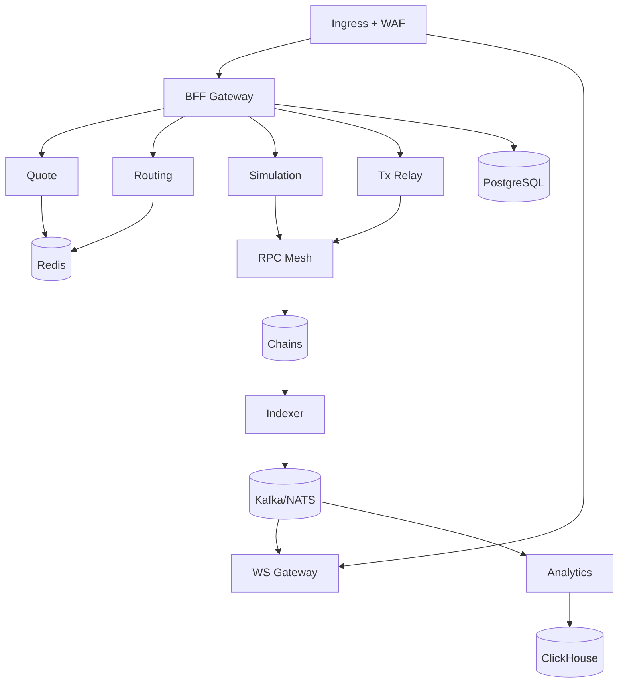

# 9) Infrastructure

## Kubernetes Topology

## Scaling

- HPA by CPU + custom latency metrics.
- WS gateway HPA by active connection count.
- indexer workers autoscale by chain lag metrics.

## Resilience

- RPC multi-provider quorum with automatic failover.
- retry budgets and circuit breakers per service.
- blue-green deployment for critical gateway services.

## Monitoring and Alerting

- metrics: Prometheus.
- traces: OpenTelemetry + Tempo/Jaeger.
- logs: Loki/ELK structured JSON.
- alerts:
  - p95 quote latency breach
  - tx success ratio drop
  - ws reconnect storm
  - indexer lag threshold

