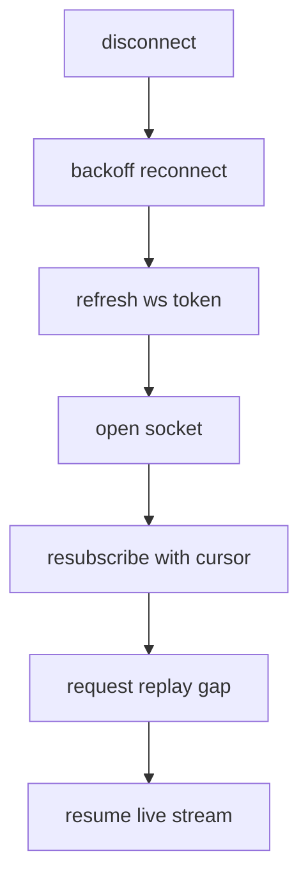

# 6) Realtime Architecture

## Websocket Infrastructure

- Edge ws ingress with TLS termination.
- Gateway pods maintain authenticated subscriptions.
- Event ingestion through Kafka/NATS.
- Redis stores session state and cursors.

## Subscription Types

- `wallet:{chainId}:{address}`
- `intent:{intentId}`
- `pool:{chainId}:{poolId}`
- `market:{chainId}:{pair}`

## Mobile-Safe Lifecycle

- foreground: full active channels.
- background: tx-intent and wallet status only.
- terminated: push notification fallback for finalized tx.

## Reconnect Flow

## Event Payload Strategy

- delta updates only.
- monotonic `event_seq` per channel.
- include `snapshot_version` for conflict detection.

## Realtime Update Categories

- transaction lifecycle
- portfolio balance changes
- LP position changes
- quote/liquidity changes

