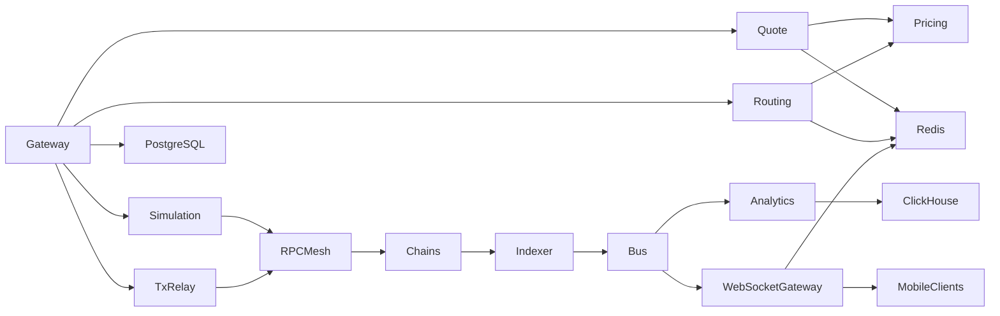

# Service Dependency Map

## Critical Paths

- Trade request path: `Gateway -> Quote/Routing/Simulation -> TxRelay`.
- Realtime status path: `Chain -> Indexer -> Bus -> WSG -> Mobile`.

## Failure Isolation Rules

- Analytics failures must never block trade path.
- Indexer lag triggers degraded mode (receipt polling fallback).
- Redis outage falls back to reduced realtime features, not API outage.

