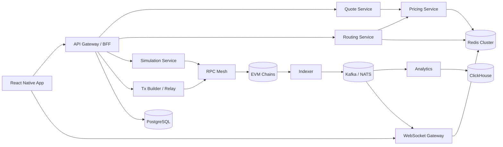
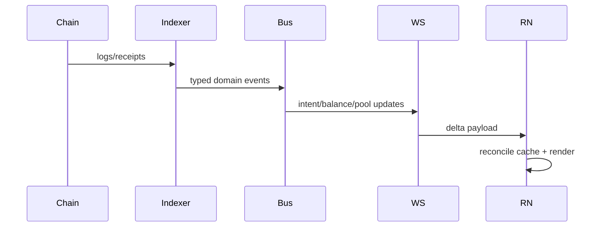

# 1) Complete System Architecture

## High-Level Architecture

## Mobile App Architecture

- Presentation: screen + component composition only.
- Domain: use-cases, entities, transaction state machine.
- Data: repository interfaces and query models.
- Infra: API clients, websocket client, wallet adapters, secure storage adapters.

## Backend Services

- BFF/Gateway: auth, request shaping, idempotency headers, request tracing.
- Quote + routing + simulation split for independent scaling.
- Tx builder/relay for deterministic calldata and optional private submission.
- Indexer + analytics decoupled from request path.

## Blockchain Interaction Layer

- RPC mesh abstraction with provider scoring and failover.
- Chain adapters by interface: `buildTx`, `simulate`, `decodeReceipt`, `subscribeLogs`.
- EVM adapter live; Solana adapter plug-in contract.

## WebSocket Flow

1. App authenticates with short-lived ws token.
2. App subscribes by channel (`wallet`, `intent`, `pool`, `market`).
3. Gateway binds subscriptions to user session in Redis.
4. Event bus fanout -> gateway shard -> delta payload to app.
5. Reconnect uses cursor replay to close event gaps.

## Event-Driven Architecture

- Source of truth is chain event ingestion.
- Transactional outbox pattern from indexer writes to bus.
- Consumers are idempotent and keyed by `event_id`.

## Infrastructure Topology

- Multi-AZ Kubernetes.
- Redis cluster (session + cache).
- PostgreSQL primary + read replicas (OLTP).
- ClickHouse cluster (OLAP).
- Kafka/NATS (durable + low-latency streams).

## Realtime Update Flow

