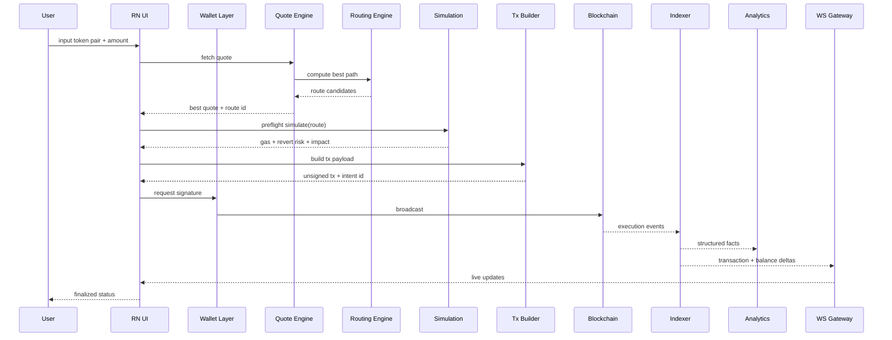

# 2) Complete DEX Trade Flow

## End-to-End Sequence

## Responsibility Split

- UI: orchestration + deterministic state transitions.
- Wallet layer: connection/session/signature boundaries.
- Quote/routing: market computation and source weighting.
- Simulation: pre-trade risk gate and user-safe output.
- Builder: canonical calldata, deadline, nonce policy.
- Indexer: reorg-safe status and balance truth.
- Analytics: asynchronous aggregation, never block trade path.

## Retry and Failure Strategy

- Quote/routing/simulation: timeout budget + retry with jitter (2 attempts).
- Broadcast: nonce conflict handling and replace transaction flow.
- Indexing lag: fallback to receipt polling until websocket catches up.
- Idempotency key on `build` and `broadcast` APIs.

## Offline Handling

- Draft trade persists locally.
- Submit action while offline creates queued intent.
- Network regained -> background sync executes queued intents with revalidation.

## Websocket Reconnect

1. detect disconnect.
2. exponential reconnect with cap.
3. auth refresh.
4. resubscribe with last event cursor.
5. replay gap via `GET /v1/realtime/replay`.

## UI State Model

- `idle`
- `quoting`
- `simulating`
- `awaiting_signature`
- `broadcasting`
- `confirming`
- `finalized`
- `failed_recoverable`
- `failed_terminal`

## Security Concerns

- stale quote replay
- slippage griefing
- wallet deep-link hijack
- unsigned payload tampering
- chain reorg consistency

## Performance Bottlenecks

- route search complexity at high pool cardinality
- RPC tail latency spikes
- websocket fanout hot channels
- mobile render pressure from high-frequency updates

