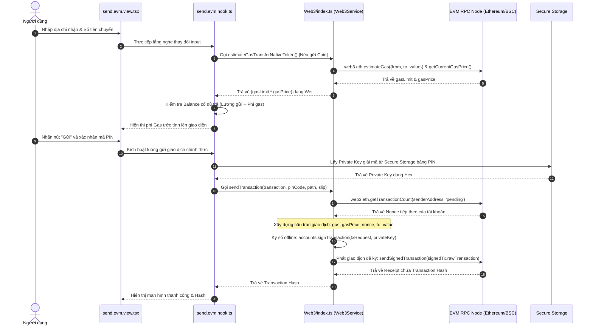

# ĐẶC TẢ KỸ THUẬT VÀ PHÂN TÍCH CHI TIẾT CƠ CHẾ CHUYỂN KHOẢN VÍ EVM TRONG CRYPTOVAULT

Tài liệu này tập trung đặc tả chi tiết toàn bộ luồng nghiệp vụ, cơ sở lý thuyết, các tệp nguồn liên quan và phân tích từng hàm (function flow) chịu trách nhiệm cho tính năng **Chuyển khoản ví EVM (Ethereum, BSC, Polygon)** trong hệ thống CryptoVault.

---

## 1. Nền tảng lý thuyết: Mô hình EVM Account và Cơ chế Gas Fee

Để hiểu cách CryptoVault triển khai chuyển khoản trên các chuỗi EVM, trước hết phải làm rõ cấu trúc tài khoản và cơ chế định giá tài nguyên mạng lưới.

```
┌────────────────────────────────────────────────────────┐
│                   MÔ HÌNH ACCOUNT STATE                │
└────────────────────────────────────────────────────────┘
  Địa chỉ Ví A (0x123...)               Địa chỉ Ví B (0xabc...)
  ┌───────────────────────┐             ┌───────────────────────┐
  │ Nonce: 4              │             │ Nonce: 1              │
  │ Balance: 1.5 ETH      │             │ Balance: 0.1 ETH      │
  │ Code: [Rỗng / EOAs]   │             │ Code: [Rỗng / EOAs]   │
  └───────────────────────┘             └───────────────────────┘
             │                                     ▲
             │ (Chuyển 0.5 ETH)                    │
             └─────────────────────────────────────┘
              Mạng lưới cập nhật State:
              - Ví A: Balance = 1.5 - 0.5 - Gas = 0.999 ETH
              - Ví B: Balance = 0.1 + 0.5 = 0.6 ETH
```

### 1.1. Mô hình Account (State-Based)
* Trái ngược với Bitcoin UTXO, Ethereum và các chuỗi EVM sử dụng mô hình **Account-based**. Trạng thái của mạng lưới (Global State) lưu giữ trực tiếp số dư (`balance`) và số lượng giao dịch đã gửi (`nonce`) của từng địa chỉ ví.
* Có hai loại tài khoản:
  1. **EOAs (Externally Owned Accounts)**: Ví do người dùng kiểm soát bằng khóa riêng (ví di động của người dùng). Không chứa code.
  2. **Contract Accounts**: Tài khoản hợp đồng thông minh chứa mã byte code và có bộ nhớ lưu trữ riêng.
* Khi thực hiện giao dịch chuyển khoản token ERC-20, ví di động thực chất là gửi một giao dịch tương tác và thực thi hàm `transfer` bên trong hợp đồng thông minh của token đó.

### 1.2. Cơ chế Gas, Gas Limit và Gas Price
Để ngăn chặn vòng lặp vô hạn và lạm dụng tài nguyên tính toán (vấn đề Halting), EVM yêu cầu trả phí cho mọi thao tác tính toán thông qua khái niệm **Gas**:
* **Gas Limit**: Số lượng đơn vị gas tối đa mà giao dịch được phép tiêu thụ.
  * Một giao dịch chuyển khoản native coin (ETH/BNB/MATIC) chuẩn từ ví EOA sang ví EOA luôn tiêu thụ cố định **21,000 gas**.
  * Chuyển khoản token ERC-20 hoặc tương tác NFT yêu cầu nhiều tài nguyên tính toán hơn, dao động từ **50,000 gas** tới hơn **100,000 gas** tùy cấu trúc mã của Smart Contract.
* **Gas Price**: Số lượng satoshi của mạng EVM (gọi là Wei hoặc Gwei, $1 \text{ Gwei} = 10^9 \text{ Wei}$) mà người dùng sẵn sàng trả cho mỗi đơn vị gas.
* Công thức tính phí mạng lưới thực tế:
  $$\text{Transaction Fee (Wei)} = \text{Gas Used} \times \text{Gas Price}$$

---

## 2. Bản đồ cấu trúc thư mục & Tệp tin liên quan trong Repo

Quy trình xử lý giao dịch EVM trong repository gồm các lớp cụ thể sau:

1. **Lớp dịch vụ lõi Web3.js**:
   * [Web3/index.ts](file:///Users/phongva/Code/CryptoVault/src/core/services/Web3/index.ts): Dịch vụ chính bao bọc thư viện Web3.js để kết nối RPC, đọc số dư, ước lượng gas và ký phát giao dịch EVM.
   * [Web3/type.ts](file:///Users/phongva/Code/CryptoVault/src/core/services/Web3/type.ts): Khai báo các cấu trúc kiểu dữ liệu tham số API.
2. **Tiện ích và Logic nghiệp vụ màn hình (UI Hook & Slice)**:
   * [send.evm.hook.ts](file:///Users/phongva/Code/CryptoVault/src/features/transfer/evm/send.evm.hook.ts): Xử lý toàn bộ logic giao diện, gọi hàm tính gas và điều phối giao dịch.
   * [send.evm.slice.ts](file:///Users/phongva/Code/CryptoVault/src/features/transfer/evm/send.evm.slice.ts): Redux slice quản lý các biến trạng thái gửi tiền của chuỗi EVM.
   * [send.evm.view.tsx](file:///Users/phongva/Code/CryptoVault/src/features/transfer/evm/send.evm.view.tsx): Giao diện nhập thông tin địa chỉ nhận, số lượng và nút gửi.

---

## 3. Sơ đồ tuần tự luồng giao dịch EVM (EVM Transfer Flow)



---

## 4. Phân tích chi tiết mã nguồn & Luồng xử lý từng hàm (Code Walkthrough)

### 4.1. Ước lượng phí Gas Native Coin và ERC-20 Token
Trước khi người dùng nhấn nút ký gửi, ứng dụng tự động hiển thị phí gas. Luồng code được phân chia thành hai nhánh tùy theo loại tài sản:

#### Nhánh 1: Ước lượng phí Gas khi chuyển Native Coin (ETH, BNB, MATIC)
Mã nguồn hàm `estimateGasTransferNativeToken` trong [Web3/index.ts](file:///Users/phongva/Code/CryptoVault/src/core/services/Web3/index.ts#L799-L826):

```typescript
async estimateGasTransferNativeToken({
  sender,
  recipientAddress,
  amount,
}: {
  sender: string;
  recipientAddress: string;
  amount: bigint;
}): Promise<bigint> {
  try {
    const [estimateGas, gasPrice] = await Promise.all([
      this.web3.eth.estimateGas({
        from: sender,
        to: recipientAddress,
        value: amount.toString(),
      }),
      this.getCurrentGasPrice(),
    ]);

    return BigInt(estimateGas) * BigInt(gasPrice);
  } catch (error) {
    ...
```

* **Phân tích kỹ thuật**:
  1. `this.web3.eth.estimateGas`: Thực hiện một cuộc gọi RPC giả định đến node mạng lưới để đo lượng gas tiêu thụ thực tế của giao dịch chuyển khoản native coin. Thông thường, phép chuyển EOA-to-EOA sẽ trả về đúng hằng số `21000`.
  2. `this.getCurrentGasPrice()`: Truy vấn phí gas trung bình hiện tại của các block gần nhất thông qua RPC node.
  3. Kết quả trả về bằng tích của `gasLimit` và `gasPrice` biểu diễn dưới dạng số nguyên lớn `bigint` (Wei) để tránh sai số dấu phẩy động trong Javascript.

#### Nhánh 2: Ước lượng phí Gas khi chuyển ERC-20 Token
Mã nguồn hàm `estimateGasTransferToken` trong [Web3/index.ts](file:///Users/phongva/Code/CryptoVault/src/core/services/Web3/index.ts#L828-L860):

```typescript
async estimateGasTransferToken({
  smartContract, amount, beneficiaryAddress, commission, recipientAddress, tokenContractAddress, sender,
}: EstimateGasFeeTransferTokenType) {
  try {
    const { contractABI } = this.instantiateASmartContract(smartContract, smartContractABIERC20);
    
    // 1. Tạo đối tượng phương thức chuyển khoản token từ contract ABI
    const contractTransfer = contractABI.methods.transferToken(
      tokenContractAddress, recipientAddress, amount, beneficiaryAddress, commission
    );
    
    // 2. Chạy thử nghiệm ước lượng gas trực tiếp trên hàm contract
    const [estimateGas, gasPrice] = await Promise.all([
      await contractTransfer.estimateGas({ from: sender }),
      this.getCurrentGasPrice(),
    ]);
    
    if (!estimateGas || !gasPrice) {
      throw new Error("Couldn't get gas price | estimate gas");
    }
    return estimateGas * gasPrice;
  } catch (error) { ... }
}
```

* **Phân tích kỹ thuật**:
  * **`instantiateASmartContract`**: Khởi dựng cầu nối Javascript tới hợp đồng thông minh ERC-20 bằng cách truyền địa chỉ hợp đồng và tệp ABI mẫu ([smartContractABIERC20](file:///Users/phongva/Code/CryptoVault/src/core/services/Web3/abi/index.ts)).
  * **`methods.transferToken`**: Cấu trúc lời gọi hàm tương tác với hợp đồng, truyền đầy đủ tham số bao gồm ví nhận, số lượng chuyển, địa chỉ thụ hưởng và lượng phí commission (nếu có).
  * **`estimateGas`**: Thư viện Web3.js gửi yêu cầu `eth_estimateGas` kèm theo mã mã hóa data call của hàm `transferToken` để TVM của node EVM chạy thử và tính lượng gas cần tiêu thụ.

---

### 4.2. Bảo vệ số dư ví di động & Tính toán số dư tối đa
Phía di động [send.evm.hook.ts](file:///Users/phongva/Code/CryptoVault/src/features/transfer/evm/send.evm.hook.ts) sử dụng kết quả ước lượng gas để bảo vệ trải nghiệm người dùng:

```typescript
// 1. Kiểm tra tài khoản có đủ coin chính làm phí gas hay không
if (gasFee > balanceCoin) {
  setError(t(LanguageKey.evm_not_enough_amount_to_cover_gas_fee));
}

// 2. Tính số lượng coin thực chuyển tối đa khi người dùng nhấn "Send Max"
const estimateGasFeeWhenSendFullBalance = await web3.estimateGasTransferNativeToken({
  sender, recipientAddress, amount: balance
});
const maxSendable = balance - estimateGasFeeWhenSendFullBalance - convertFeeToBigInt;
```

* **Ý nghĩa**:
  * Khi chuyển token ERC-20, phí gas bắt buộc phải trả bằng coin chính của mạng lưới (ví dụ chuyển USDT ERC-20 cần trả phí bằng ETH). Hệ thống kiểm tra chéo số dư ETH khả dụng có lớn hơn lượng phí ước tính `gasFee` hay không trước khi mở nút bấm "Gửi".
  * Khi người dùng nhấn nút chuyển tối đa số dư (Send Max) đối với coin chính, hệ thống tự động trừ đi phần phí gas dự toán để đảm bảo tài khoản sau khi chuyển đi sẽ có số dư vừa vặn bằng 0 mà không bị lỗi giao dịch thất bại do không đủ gas.

---

### 4.3. Ký số ngoại tuyến và phát giao dịch (Offline Signing & Broadcast)
Khi người dùng bấm xác nhận, mã nguồn hàm `sendTransaction` trong [Web3/index.ts](file:///Users/phongva/Code/CryptoVault/src/core/services/Web3/index.ts#L1527-L1558) được kích hoạt:

```typescript
async sendTransaction(
  transaction: Transaction,
  pinCode: string,
  path: string,
  slip: number
) {
  // 1. Giải mã lấy Private Key từ Secure Storage và Nonce từ chuỗi
  const data = await this.getPrivateKeyAndNonceAddress(pinCode, path, slip);
  if (!data) {
    throw new Error("Could not get wallet");
  }
  const privateKey = Buffer.from(data.privateKey, "hex");
  
  try {
    // 2. Xây dựng tham số yêu cầu giao dịch hoàn chỉnh
    let txRequest: Transaction = {
      ...transaction,
      gas: BigInt(transaction.gas + ""),
      value: BigInt(transaction.value + ""),
      gasPrice: await this.getCurrentGasPrice(),
      nonce: data.nonce, // Nonce tăng tuần tự đảm bảo thứ tự thực thi
    };
    
    // 3. Ký giao dịch cục bộ trong bộ nhớ tạm di động (ECDSA secp256k1)
    const signedTx = await this.web3.eth.accounts.signTransaction(
      txRequest,
      privateKey
    );
    
    // 4. Phát chuỗi Bytes đã ký lên RPC Node để xử lý
    const receipt = await this.web3.eth.sendSignedTransaction(
      signedTx.rawTransaction
    );
    return receipt.transactionHash;
  } catch (error) {
    console.error("Error signing or sending transaction:", error);
  }
}
```

#### 📌 Phân tích kỹ thuật chi tiết:
* **`getPrivateKeyAndNonceAddress`**:
  * Hàm này lấy mã PIN của người dùng giải mã Master Key, lấy ra khóa riêng (Private Key) tương ứng dưới dạng mã lục phân (Hex String).
  * Đồng thời, ví tự động gọi `web3.eth.getTransactionCount(senderAddress, 'pending')` để lấy số lượng giao dịch đã được thực thi và đang xếp hàng của tài khoản ví gửi để gán làm giá trị `nonce`. Giá trị nonce ngăn chặn hoàn toàn tấn công phát lại (Replay Attack) giao dịch cũ.
* **`signTransaction`**:
  * Sử dụng thuật toán ký số **ECDSA secp256k1** để ký lên hash thông điệp đại diện cho cấu trúc giao dịch. Chữ ký tạo ra gồm các phần tử $(r, s, v)$ được đóng gói trực tiếp vào thuộc tính `rawTransaction` dạng RLP-encoded bytes.
* **`sendSignedTransaction`**:
  * Phát chuỗi bytes đã ký lên mạng blockchain thông qua RPC node. Kể từ thời điểm này, khóa riêng đã được cất giấu an toàn, chỉ có gói tin giao dịch được phát đi công khai, đảm bảo tính bảo mật tuyệt đối cho tài khoản ví của người dùng.
