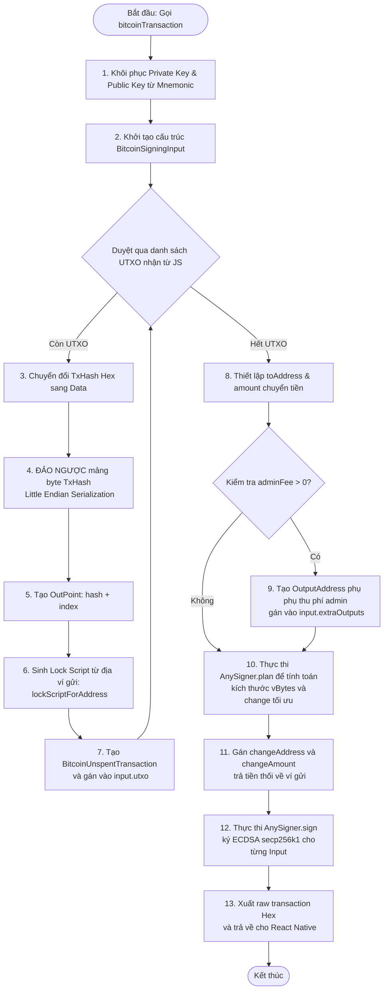
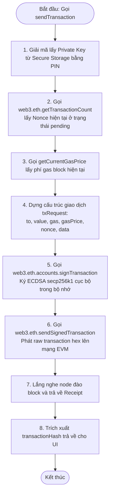

# SƠ ĐỒ THỰC THI CHI TIẾT CỦA CÁC HÀM CHUYỂN KHOẢN (BITCOIN, EVM & TON)

Tài liệu này cung cấp các sơ đồ khối (Flowcharts) trực quan hóa chi tiết từng bước xử lý dữ liệu, kiểm tra điều kiện và thực thi mật mã học bên trong các hàm chuyển khoản cốt lõi của hệ thống CryptoVault.

---

## 1. Phân hệ Bitcoin (BTC UTXO Sign Engine)

Sơ đồ khối của hàm native **`bitcoinTransaction`** trong [BitcoinModule.swift](file:///Users/phongva/Code/CryptoVault/modules/BitcoinModule/BitcoinModule.swift#L137-L282):



---

## 2. Phân hệ TON Blockchain (Wallet V5R1 Multi-Message)

Sơ đồ luồng logic của hàm **`createTransfer`** trong [tonTransactions.ts](file:///Users/phongva/Code/CryptoVault/src/core/services/TonTransactions/tonTransactions.ts#L43-L148) phối hợp với các phương thức của [transferUtils.ts](file:///Users/phongva/Code/CryptoVault/src/core/services/TonTransactions/transferUtils.ts):

```mermaid
flowchart TD
    Start([Bắt đầu: Gọi createTransfer]) --> InitWallet[1. Khôi phục V5R1 Contract &\n Ghép 32-byte PrivKey + PubKey thành 64-byte secretKey]
    InitWallet --> GetAccount[2. Tải thông tin tài khoản hiện tại từ RPC]
    GetAccount --> ParseAddresses[3. Phân tích địa chỉ ví Nhận & ví Admin]
    
    %% Bounce logic
    ParseAddresses --> CheckActive{Kiểm tra trạng thái ví Nhận\n status == Active?}
    CheckActive -- Đúng --> SetBounceTrue[4. Đặt bounce = true]
    CheckActive -- Sai --> SetBounceFalse[5. Đặt bounce = false]
    
    %% Build messages
    SetBounceTrue --> BuildInternal[6. Tạo mảng internalMessages\n Đẩy message chuyển tiền cho người nhận vào]
    SetBounceFalse --> BuildInternal
    BuildInternal --> CheckAdminFee{Kiểm tra adminFee > 0?}
    CheckAdminFee -- Đúng --> PushAdminMsg[7. Đẩy message thứ 2 gửi phí tới admin\n vào mảng internalMessages]
    CheckAdminFee -- Sai --> GetSeqno[8. Gọi getSeqno lấy số đếm của ví gửi\n trên chain (mặc định = 0)]
    PushAdminMsg --> GetSeqno
    
    %% Ký và tạo BOC
    GetSeqno --> ExternalMsg[9. contract.createTransfer: ký NaCl ED25519\n đóng gói thành External Message Cell]
    ExternalMsg --> SerializeBOC[10. Chuyển Cell sang định dạng nhị phân BOC\n và mã hóa chuỗi Base64]
    
    %% Emulation
    SerializeBOC --> CheckEstimate{Tham số estimateFee == true?}
    CheckEstimate -- Đúng --> EmulateTVM[11. Gửi BOC lên RPC /emulate để TVM\n chạy thử đo gas & kiểm tra lỗi]
    CheckEstimate -- Không --> ReturnBOC[12. Trả về messageBOCString & txHash]
    
    EmulateTVM --> CheckEmulateError{Giả lập có hành động thất bại?}
    CheckEmulateError -- Có --> ThrowError[13. Báo lỗi và hủy giao dịch]
    CheckEmulateError -- Không --> ReturnAll[14. Trả về BOC + thông tin phí giả lập]
    
    ReturnBOC --> End([Kết thúc])
    ReturnAll --> End
    ThrowError --> End
```

---

## 3. Phân hệ EVM Blockchain (Web3 Wallet Signing)

Sơ đồ luồng xử lý của hàm **`sendTransaction`** trong [Web3/index.ts](file:///Users/phongva/Code/CryptoVault/src/core/services/Web3/index.ts#L1527-L1558):


