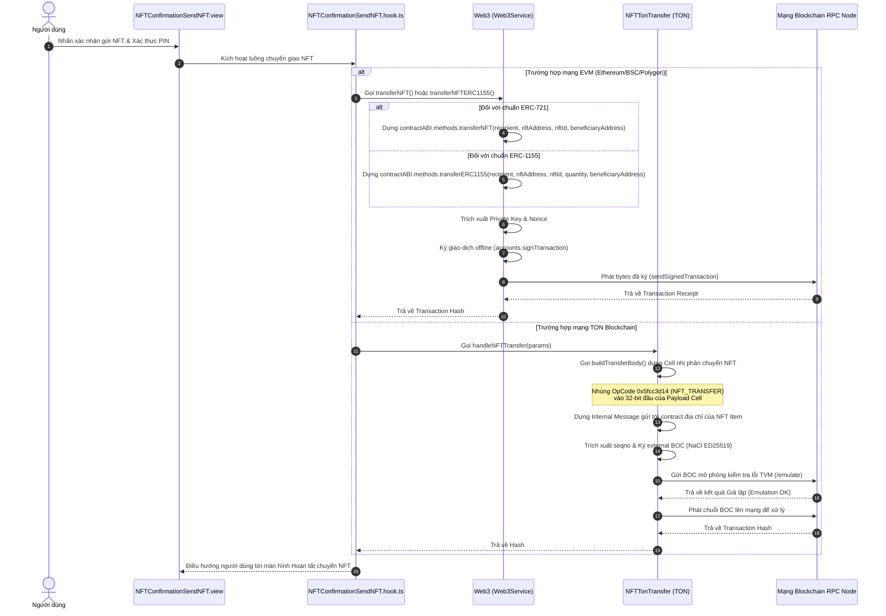

# ĐẶC TẢ KỸ THUẬT VÀ PHÂN TÍCH CHI TIẾT CƠ CHẾ CHUYỂN KHOẢN NFT TRÊN CÁC MẠNG LƯỚI

Tài liệu này tập trung đặc tả chi tiết toàn bộ luồng nghiệp vụ, cơ sở lý thuyết, các tệp nguồn liên quan và phân tích từng hàm (function flow) chịu trách nhiệm cho tính năng **Chuyển khoản tài sản không thể thay thế (NFT)** trên cả hai hệ sinh thái **EVM** và **TON Blockchain** trong hệ thống CryptoVault.

---

## 1. Nền tảng lý thuyết: Tiêu chuẩn NFT trên EVM và TON Blockchain

Cơ chế quản lý và chuyển giao NFT giữa hai hệ sinh thái EVM và TON có sự khác biệt sâu sắc về mặt kiến trúc lưu trữ:

```
 KIẾN TRÚC EVM (ERC-721/1155)                  KIẾN TRÚC TON (TIP-62)
┌─────────────────────────────────┐           ┌──────────────────────────────────┐
│ Contract Collection (Single DB) │           │    Collection Contract (Mẹ)      │
│ ┌─────────────────────────────┐ │           │                │                 │
│ │ Token ID 1 ──► Địa chỉ Ví A  │ │           │      ┌─────────┴─────────┐       │
│ │ Token ID 2 ──► Địa chỉ Ví B  │ │           │      ▼                   ▼       │
│ │ Token ID 3 ──► Địa chỉ Ví A  │ │           │  NFT Item 1          NFT Item 2  │
│ └─────────────────────────────┘ │           │ (Ví riêng biệt)     (Ví riêng biệt)│
│                                 │           │  Address: 0xabc...   Address: 0x123...│
│ (Mọi thay đổi số dư ghi chung   │           │                                  │
│  trên duy nhất 1 Smart Contract)│           │ (Mỗi NFT là 1 contract con riêng,│
│                                 │           │  chuyển tiền = gửi tin nhắn tới ví)│
└─────────────────────────────────┘           └──────────────────────────────────┘
```

### 1.1. Tiêu chuẩn NFT trên mạng EVM (ERC-721 và ERC-1155)
* **ERC-721 (Non-Fungible Token)**: Mỗi NFT là độc bản, được định danh bằng một `tokenId` số nguyên duy nhất bên trong một địa chỉ hợp đồng bộ sưu tập (`nftAddress`).
* **ERC-1155 (Multi-Token Standard)**: Tiêu chuẩn đa token cho phép lưu trữ cả tài sản không thể thay thế (NFT) lẫn tài sản có thể thay thế (Fungible Token) trong cùng một hợp đồng. Một `tokenId` có thể sở hữu bởi nhiều ví với số lượng (`quantity`) khác nhau.
* **Quy trình chuyển giao**: Trên EVM, việc chuyển khoản thực chất là gọi hàm `safeTransferFrom` hoặc hàm tùy biến `transferNFT` trên hợp đồng thông minh của bộ sưu tập. Hàm này sẽ cập nhật trực tiếp biến ánh xạ trạng thái sở hữu (mapping `_owners`) bên trong bộ nhớ của hợp đồng đó.

### 1.2. Tiêu chuẩn NFT trên TON Blockchain (TIP-62)
* Khác biệt hoàn toàn với EVM, TON thiết kế theo triết lý phi tập trung hóa bộ nhớ. **Mỗi NFT Item là một Smart Contract độc lập** được triển khai riêng biệt trên chuỗi. Hợp đồng NFT bộ sưu tập (Collection Contract) chỉ đóng vai trò sinh mã deploy và chứng thực tính chính danh của các NFT con.
* **Quy trình chuyển giao**: Để chuyển NFT trên TON, ví di động gửi một **Thông điệp nội bộ (Internal Message)** trực tiếp đến địa chỉ ví hợp đồng của NFT Item đó. Trong thân thông điệp (Payload Cell), ví nhúng mã OpCode chỉ định hành động chuyển NFT cùng thông tin ví nhận.

---

## 2. Bản đồ cấu trúc thư mục & Tệp tin liên quan trong Repo

Quy trình xử lý giao dịch gửi NFT trong repository gồm các lớp cụ thể sau:

1. **Lớp dịch vụ Web3.js (EVM)**:
   * [Web3/index.ts](file:///Users/phongva/Code/CryptoVault/src/core/services/Web3/index.ts): Chứa các hàm `transferNFT` (ERC-721) và `transferNFTERC1155` (ERC-1155).
   * [Web3/abi/smartContractABIERC20.ts](file:///Users/phongva/Code/CryptoVault/src/core/services/Web3/abi/smartContractABIERC20.ts): ABI bọc cổng API chuyển khoản NFT ERC-721.
   * [Web3/abi/smartContractABIERC1155.ts](file:///Users/phongva/Code/CryptoVault/src/core/services/Web3/abi/smartContractABIERC1155.ts): ABI bọc cổng API chuyển khoản NFT ERC-1155.
2. **Lớp dịch vụ TON SDK (TON)**:
   * [TonTransactions/NFTTransfer.ts](file:///Users/phongva/Code/CryptoVault/src/core/services/TonTransactions/NFTTransfer.ts): Lớp chính đóng gói cấu trúc nhị phân chuyển đổi NFT trên TON.
   * [TonTransactions/opCode.ts](file:///Users/phongva/Code/CryptoVault/src/core/services/TonTransactions/opCode.ts): Khai báo OpCode `NFT_TRANSFER = 0x5fcc3d14`.
3. **Màn hình giao dịch di động (React Native Components & Hooks)**:
   * [NFTSend/NFTSend.hook.ts](file:///Users/phongva/Code/CryptoVault/src/features/home/NFTCollection/evm/NFTSend/NFTSend.hook.ts): Xử lý ước lượng gas gửi NFT.
   * [NFTConfirmationSendNFT/NFTConfirmationSendNFT.hook.ts](file:///Users/phongva/Code/CryptoVault/src/features/home/NFTCollection/evm/NFTConfirmationSendNFT/NFTConfirmationSendNFT.hook.ts): Xử lý xác nhận ký và phát giao dịch gửi NFT.

---

## 3. Sơ đồ tuần tự luồng giao dịch chuyển NFT (NFT Transfer Flow)



---

## 4. Phân tích chi tiết mã nguồn & Luồng xử lý từng hàm (Code Walkthrough)

### 4.1. Phân hệ TON Blockchain (Xây dựng Payload nhị phân Cell)
Khi chuyển NFT trên chuỗi TON, mã nguồn [NFTTransfer.ts](file:///Users/phongva/Code/CryptoVault/src/core/services/TonTransactions/NFTTransfer.ts) thực thi việc tạo thân thông điệp chuyển NFT:

#### 1. Hàm dựng Payload Cell: `buildTransferBody`
```typescript
private buildTransferBody({
    recipientAddress,
    senderAddressString,
}: {
    recipientAddress: string;
    senderAddressString: string;
}): any {
    const body = beginCell()
        .storeUint(TonOpCodes.NFT_TRANSFER, 32) // Dòng A: OpCode 32-bit (0x5fcc3d14)
        .storeUint(TransferUtils.getWalletQueryId(), 64) // Dòng B: Query ID 64-bit
        .storeAddress(Address.parse(recipientAddress)) // Dòng C: Địa chỉ người nhận mới
        .storeAddress(Address.parse(senderAddressString)) // Dòng D: Ví phản hồi (thường là người gửi)
        .storeUint(0, 1) // Dòng E: Custom payload flag (0 nghĩa là không dùng)
        .storeCoins(1) // Dòng F: Lượng Forward TON (1 nano TON)
        .storeUint(0, 1) // Dòng G: Forward payload flag (0 nghĩa là không dùng)
        .endCell();
    return body;
}
```

* **Phân tích kỹ thuật chi tiết**:
  * **`TonOpCodes.NFT_TRANSFER` (0x5fcc3d14)**: Đây là mã OpCode cố định theo đặc tả kỹ thuật tiêu chuẩn của hợp đồng thông minh NFT trên mạng TON (TIP-62). Khi hợp đồng NFT nhận được thông điệp có OpCode này, nó hiểu người gửi muốn thay đổi quyền sở hữu NFT.
  * **`getWalletQueryId`**: Sinh chuỗi query ID ngẫu nhiên giúp truy vết giao dịch.
  * **`storeAddress(recipientAddress)`**: Ghi địa chỉ chủ sở hữu mới của NFT. Hợp đồng NFT con sẽ cập nhật địa chỉ chủ sở hữu (Owner Address) trong bộ nhớ lưu trữ của nó thành địa chỉ này sau khi giao dịch thành công.
  * **`storeAddress(senderAddressString)`**: Địa chỉ nhận lượng TON thừa thãi của phí gas sau khi giao dịch hoàn tất (thường gán ngược lại cho chính người gửi để thu hồi coin dư).
  * **`storeCoins(1)`**: Lượng Forward TON tối thiểu được chuyển sang ví nhận kèm theo thông điệp thông báo.

#### 2. Hàm điều phối: `handleNFTTransfer`
```typescript
const bodyNFTTransfer = this.buildTransferBody({ recipientAddress, senderAddressString });
const internalMessages = [
    internal({
        to: nftAddressString, // Gửi trực tiếp tới địa chỉ của NFT Item Contract
        bounce: true,
        value: amountSending, // Lượng gas gửi kèm để thực thi
        body: bodyNFTTransfer, // Payload Cell dựng ở trên
    }),
];

if (adminFee > 0) {
    internalMessages.push(
        internal({ to: adminAddress, bounce: tonAdminBounce, value: adminFee, body: 'Admin Fee' }),
    );
}

const seqno = await TransferUtils.getSeqno({ currentSeqno: 0, finalFromAccountData: tonDataRes });

const transferData = await TransferUtils.createExternalTransfer({
    internalMessages, secretKey, sendMode: SendMode.PAY_GAS_SEPARATELY + SendMode.IGNORE_ERRORS, contract, seqno,
});
```

* **Ý nghĩa**:
  * Giao dịch được gửi trực tiếp tới địa chỉ của hợp đồng ví NFT (`to: nftAddressString`).
  * Nếu có phí nền tảng, app đẩy thêm một thông điệp nội bộ thứ hai gửi phí tới admin của nền tảng (`adminAddress`), tận dụng tối đa sức mạnh giao dịch đa thông điệp (Multi-message) của Wallet V5R1.

---

### 4.2. Phân hệ EVM Blockchain (ERC-721 và ERC-1155)
Quy trình gửi NFT trên mạng EVM được quản lý thông qua hai phương thức Web3 trong [Web3/index.ts](file:///Users/phongva/Code/CryptoVault/src/core/services/Web3/index.ts):

#### 1. Chuyển khoản NFT ERC-721: `transferNFT`
```typescript
async transferNFT({
  beneficiaryAddress, pinCode, commission, nftAddress, nftId, recipient, smartContractUseForTransfer, path, slip, decimals
}: NFTTransferType) {
  try {
    const { contractABI } = this.instantiateASmartContract(smartContractUseForTransfer, smartContractABIERC20);
    const data = await this.getPrivateKeyAndNonceAddress(pinCode, path, slip);

    const commissionAdmin = Utils.convertAmountToWeiFollowDecimals(commission, decimals);

    // Dựng hàm transferNFT từ contract ABI
    const transferMethod = contractABI.methods?.transferNFT(
      recipient, nftAddress, nftId, beneficiaryAddress
    );

    const txData = transferMethod?.encodeABI();

    const [estimatedGas, feeDataTransferTransaction, gasPrice] = await Promise.all([
      transferMethod?.estimateGas({ from: data.walletAddress, value: commissionAdmin + "" }),
      this.web3.eth.calculateFeeData(),
      this.getCurrentGasPrice(),
    ]);

    let txRequest: Transaction = {
      from: data.walletAddress,
      to: contractABI.options.address, // Địa chỉ ví API trung gian thực thi chuyển khoản
      gas: estimatedGas,
      data: txData,
      value: commissionAdmin,
      nonce: data.nonce,
      gasPrice,
    };
    ...
```

* **Phân tích kỹ thuật chi tiết**:
  * **`methods.transferNFT`**: CryptoVault sử dụng một hợp đồng thông minh chuyển khoản trung gian (Smart Contract API) có nhiệm vụ trích xuất phí hoa hồng nền tảng (`commissionAdmin`) chuyển tới `beneficiaryAddress` và thực thi lệnh chuyển nhượng NFT từ ví gửi sang ví ví nhận.
  * **`encodeABI`**: Mã hóa cấu trúc lời gọi hàm thành dạng Bytecode lục phân nhị phân (Data Payload) mà máy ảo EVM có thể giải mã và thực thi.
  * **`signTransaction`**: Giao dịch sau đó được ký offline và phát qua RPC node.

#### 2. Chuyển khoản NFT ERC-1155: `transferNFTERC1155`
```typescript
const transferMethod = contractABI.methods?.transferERC1155(
  recipient,
  nftAddress,
  nftId,
  quantity,
  beneficiaryAddress
);
```

* **Phân tích kỹ thuật**:
  * Khác biệt duy nhất của chuẩn ERC-1155 so với ERC-721 là có thêm tham số **`quantity`** (số lượng token muốn gửi đi). Một `nftId` trong ERC-1155 có thể chứa nhiều số lượng khác nhau, do đó ví di động bắt buộc phải truyền giá trị `quantity` lớn hơn 0 để máy ảo EVM trừ số dư chính xác.
