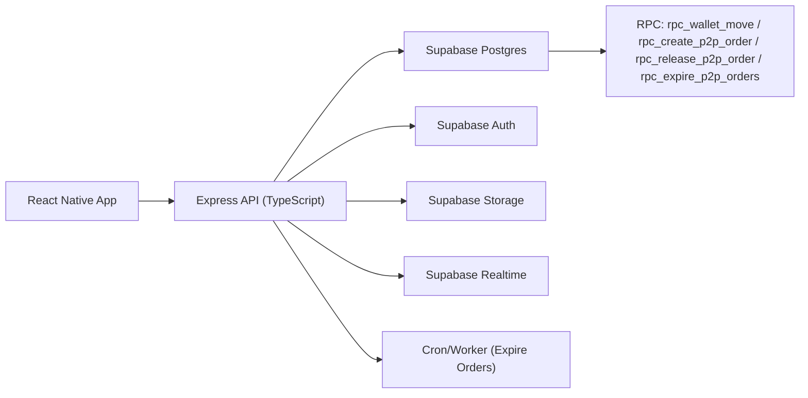
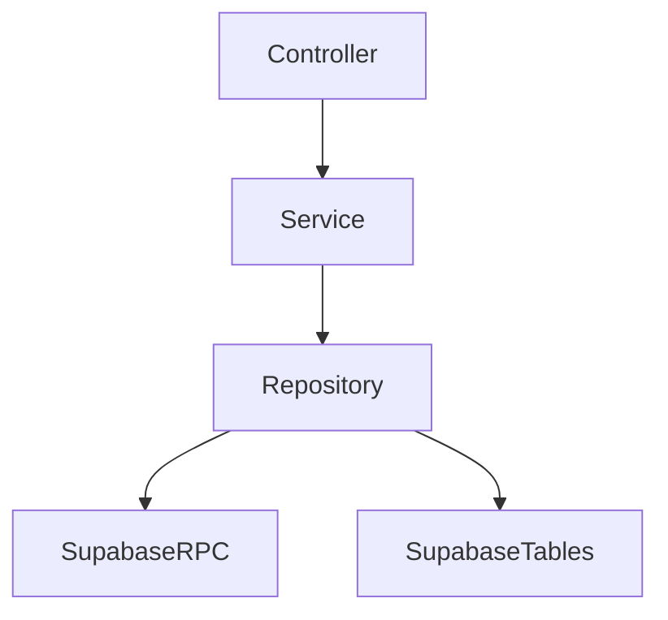
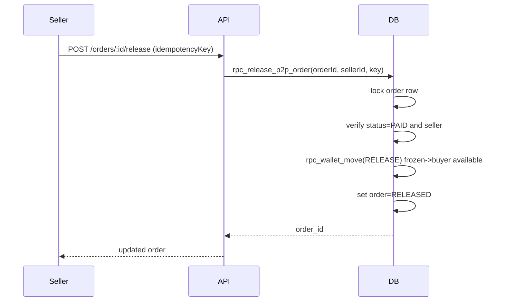

# P2P Crypto Marketplace MVP (Binance P2P style)

## Architecture


## Service Dependency Map


## Backend Folder
```text
p2p-backend/
  src/
    core/              # env, logger, supabase client
    middleware/        # auth, error, job secret
    modules/p2p/       # schema/repo/service/controller/routes
    shared/            # typed API response
```

## Mobile Folder
```text
src/features/p2p/
  services/p2pApi.ts
  shared/types.ts
  screens/
    P2PMarketScreen.tsx
    CreateAdScreen.tsx
    P2POrderDetailScreen.tsx
```

## APIs (implemented)
- `GET /api/v1/p2p/ads`
- `POST /api/v1/p2p/ads`
- `GET /api/v1/p2p/orders`
- `POST /api/v1/p2p/orders`
- `GET /api/v1/p2p/orders/:orderId`
- `POST /api/v1/p2p/orders/:orderId/paid`
- `POST /api/v1/p2p/orders/:orderId/release`
- `POST /api/v1/p2p/orders/:orderId/dispute`
- `GET /api/v1/p2p/orders/:orderId/chat`
- `POST /api/v1/p2p/orders/:orderId/chat`
- `POST /api/v1/p2p/jobs/expire-orders` (`x-job-secret`)

## SQL Deliverables
- Schema/RLS/RPC: [supabase/p2p_mvp.sql](/Users/phongva/Code/CryptoVault/supabase/p2p_mvp.sql)
- Seed demo: [supabase/p2p_seed.sql](/Users/phongva/Code/CryptoVault/supabase/p2p_seed.sql)

## Critical Sequence (release)


## Security Controls
- Financial mutations only in SQL RPC (atomic, server-side).
- No client-side balance mutation.
- JWT verified at backend via Supabase Auth.
- Service role key only in backend.
- Zod validation on every write endpoint.
- Release uses idempotency key + DB uniqueness.
- Audit logs for release/dispute.
- Job endpoint protected by secret.

## Scaling Strategy
- Read path (`/ads`) cache layer (Redis) ready.
- Write path isolated via RPC (safe concurrency).
- Expire job externalizable to BullMQ worker.
- Realtime fanout via Supabase Realtime channels.
- Future multi-asset/multi-fiat via `asset_code/network_code/fiat_code`.
