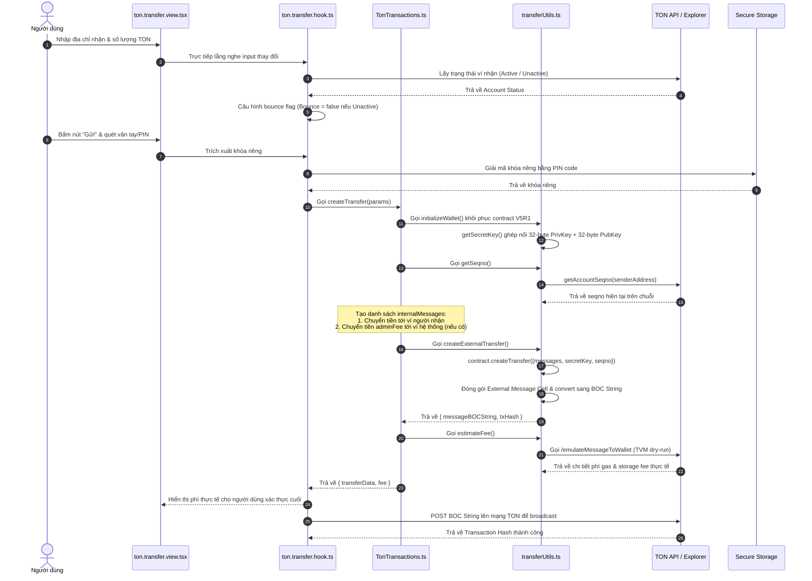

# ĐẶC TẢ KỸ THUẬT VÀ PHÂN TÍCH CHI TIẾT CƠ CHẾ CHUYỂN KHOẢN VÍ TON TRONG CRYPTOVAULT

Tài liệu này tập trung đặc tả chi tiết toàn bộ luồng nghiệp vụ, cơ sở lý thuyết, các tệp nguồn liên quan và phân tích từng hàm (function flow) chịu trách nhiệm cho tính năng **Chuyển khoản ví TON (The Open Network)** trong hệ thống CryptoVault.

---

## 1. Nền tảng lý thuyết: Kiến trúc mạng TON và Tiêu chuẩn Ví W5

Mạng lưới TON (The Open Network) được thiết kế dựa trên các nguyên lý hoàn toàn khác biệt với EVM và Bitcoin:

```
┌────────────────────────────────────────────────────────┐
│               MÔ HÌNH DIỄN VIÊN (ACTOR MODEL) TON      │
└────────────────────────────────────────────────────────┘
  Ví gửi (EOA V5R1)                      Ví nhận (Smart Contract)
  ┌───────────────────────┐             ┌───────────────────────┐
  │ Balance: 15 TON       │             │ Balance: 2 TON        │
  │ Seqno: 82             │             │ Status: Unactive      │
  └───────────────────────┘             └───────────────────────┘
             │                                     ▲
             │ (External Inbound Message)          │
             ├─────────────────────────────────────┤
             │ Kèm theo Internal Message:          │
             │ - value: 3 TON                      │
             │ - bounce: false (Địa chỉ chưa Active)│
             ▼                                     │
    [TON Virtual Machine - TVM]                    │
    Thực thi trừ balance và phí gas,               │
    Gửi internal message đi ───────────────────────┘
```

### 1.1. Mô hình Diễn viên (Actor Model) và Cấu trúc Cell (BOC)
* Trên TON Blockchain, **mọi tài khoản đều là một hợp đồng thông minh (smart contract)**. Ngay cả ví của người dùng (EOA) cũng là một hợp đồng ví (Wallet Contract) trung gian.
* Việc giao tiếp giữa các thực thể được thực hiện hoàn toàn bất đồng bộ thông qua các **Thông điệp (Messages)**.
* Dữ liệu trên TON được tổ chức dưới dạng cây các ô bộ nhớ (**Cells**). Mỗi Cell có thể chứa tối đa 1023 bits dữ liệu và liên kết tới tối đa 4 Cell con.
* Một gói tin giao dịch hoàn chỉnh được serialize thành chuỗi nhị phân gọi là **Bag of Cells (BOC)** để truyền tải qua mạng lưới.

### 1.2. Chuẩn ví thế hệ mới: TON Wallet V5R1 (W5)
Hệ thống CryptoVault hỗ trợ chuẩn ví **V5R1** (W5), đây là phiên bản ví thông minh cải tiến vượt trội so với V4R2 truyền thống:
1. **Gasless Transactions**: Cho phép các bên dApp trả phí gas hộ người dùng thông qua cơ chế chữ ký ủy quyền.
2. **Multi-messages**: Hỗ trợ đóng gói tối đa **255 thông điệp nội bộ** vào trong một giao dịch ký ngoài duy nhất, giúp thực thi các hành động phức tạp song song (ví dụ: chuyển tiền cho người nhận và đồng thời trích phí admin chỉ bằng 1 chữ ký).
3. **Flexible Extension (Plugins)**: Cho phép kết nối các module mở rộng có thể tự động ký trừ tiền ví (Subscription thanh toán định kỳ) mà không cần can thiệp lại vào mã nguồn hợp đồng ví gốc.

### 1.3. Định dạng Địa chỉ Ví TON: Bounceable vs Non-Bounceable
* **Bounceable (đầu mã `EQ`)**: Địa chỉ ví mặc định. Nếu gửi tiền tới một địa chỉ Bounceable chưa được kích hoạt hoặc gặp lỗi thực thi, TVM sẽ tự động gửi trả (bouncing) lượng tiền đó quay ngược về ví người gửi (sau khi trừ phí gas).
* **Non-Bounceable (đầu mã `UQ`)**: Sử dụng khi chuyển tiền cho các địa chỉ ví chưa từng có lịch sử hoạt động trên chuỗi (chưa kích hoạt). Giao dịch gửi đến địa chỉ Non-Bounceable sẽ không bị hoàn trả kể cả khi ví nhận chưa tồn tại.

---

## 2. Bản đồ cấu trúc thư mục & Tệp tin liên quan trong Repo

Quy trình xử lý giao dịch TON trong repository gồm các lớp cụ thể sau:

1. **Lớp nghiệp vụ giao dịch TON (Core TON SDK & TVM Interops)**:
   * [TonTransactions/tonTransactions.ts](file:///Users/phongva/Code/CryptoVault/src/core/services/TonTransactions/tonTransactions.ts): Định nghĩa các phương thức tạo giao dịch chuyển khoản TON native và Jetton token.
   * [TonTransactions/transferUtils.ts](file:///Users/phongva/Code/CryptoVault/src/core/services/TonTransactions/transferUtils.ts): Thư viện tiện ích tính toán seqno, ghép khóa bí mật, ước lượng phí qua TVM Emulator và chuyển đổi BOC.
   * [TonWallet/index.ts](file:///Users/phongva/Code/CryptoVault/src/core/services/TonWallet/index.ts): Định nghĩa phương thức khởi tạo đối tượng hợp đồng ví `WalletContractV5R1`.
2. **Tiện ích giao diện và Quản lý UI (UI Hook & View)**:
   * [ton.transfer.hook.ts](file:///Users/phongva/Code/CryptoVault/src/features/transfer/ton/ton.transfer.hook.ts): Xử lý trạng thái UI, gọi API lấy thông tin số dư, kiểm tra kích hoạt ví nhận và kích hoạt chuyển khoản.
   * [ton.transfer.view.tsx](file:///Users/phongva/Code/CryptoVault/src/features/transfer/ton/ton.transfer.view.tsx): Giao diện điền thông tin và nút xác thực PIN.

---

## 3. Sơ đồ tuần tự luồng giao dịch TON (TON Transfer Flow)



---

## 4. Phân tích chi tiết mã nguồn & Luồng xử lý từng hàm (Code Walkthrough)

### 4.1. Khởi tạo ví thông minh V5R1
Khi bắt đầu giao dịch, hệ thống khôi phục cấu trúc ví thông minh TON tại [TonWallet/index.ts](file:///Users/phongva/Code/CryptoVault/src/core/services/TonWallet/index.ts):

```typescript
const wallet = WalletContractV5R1.create({
    workchain: 0,
    publicKey: publicKeyBuffer,
    walletId: {
        networkGlobalId: isTestNet ? TonNetwork.TESTNET : TonNetwork.MAINNET,
    },
});
```

* **Phân tích chi tiết**:
  * **`workchain: 0`**: Đặt ví hoạt động trên Basechain (Workchain mặc định của TON dành cho các giao dịch người dùng).
  * **`networkGlobalId`**: Đây là điểm cải tiến bảo mật tối quan trọng của V5R1. Hằng số mạng lưới (`-273` cho Mainnet và `-1201607692` cho Testnet) được nhúng thẳng vào cấu trúc ID ví thông minh. Cơ chế này ngăn chặn tuyệt đối cuộc tấn công phát lại chéo chuỗi (Cross-chain Replay Attack) - nơi tin tặc lấy chuỗi BOC đã ký của người dùng trên mạng Testnet phát lại lên mạng Mainnet để đánh cắp tiền thật.

---

### 4.2. Đóng gói Thông điệp đa hợp đồng (Multi-message Packaging)
Mã nguồn hàm `createTransfer` trong [TonTransactions/tonTransactions.ts](file:///Users/phongva/Code/CryptoVault/src/core/services/TonTransactions/tonTransactions.ts#L93-L124) đóng gói các thông điệp:

```typescript
const internalMessages = [
    internal({
        to: recipientAddressValid,
        bounce: finalBounce,
        value: sendAmount,
        body: memo,
    }),
];

// Nếu có phí admin, đẩy tiếp thông điệp thứ hai vào chung mảng gửi
if (adminFee > 0) {
    internalMessages.push(
        internal({
            to: adminTONAddress,
            bounce: tonAdminBounce,
            value: adminFee,
            body: 'Admin fee',
        }),
    );
}

const seqno = await TransferUtils.getSeqno({ currentSeqno: 0, finalFromAccountData });

const transferData = await TransferUtils.createExternalTransfer({
    internalMessages,
    secretKey,
    sendMode: SendMode.PAY_GAS_SEPARATELY + SendMode.IGNORE_ERRORS,
    contract,
    seqno,
});
```

* **Phân tích chi tiết**:
  * **`internalMessages`**: Mảng chứa các Cell thông điệp nội bộ. Nếu `adminFee > 0`, nó sẽ có 2 phần tử. Chuỗi W5 sẽ thực thi đồng thời cả hai lệnh chuyển tiền này atomically.
  * **`SendMode.PAY_GAS_SEPARATELY` (Cờ 1)**: Yêu cầu TVM trừ phí gas giao dịch riêng biệt ra khỏi số dư của ví gửi chứ không khấu trừ vào số tiền nằm trong các internal messages chuyển đi.
  * **`SendMode.IGNORE_ERRORS` (Cờ 2)**: Đảm bảo nếu một thông điệp trong danh sách gặp sự cố (ví dụ: ví nhận bị lỗi), giao dịch vẫn tiếp tục thực thi các thông điệp còn lại mà không rollback toàn bộ.

---

### 4.3. Ký số NaCl ED25519 và Tạo BOC
Hàm `createExternalTransfer` trong [TonTransactions/transferUtils.ts](file:///Users/phongva/Code/CryptoVault/src/core/services/TonTransactions/transferUtils.ts#L51-L91):

```typescript
const body = (contract as OpenedContract<WalletContractV5R1>).createTransfer({
    messages: internalMessages,
    secretKey: secretKey,
    sendMode: sendMode,
    seqno: seqno,
});

const externalMessage = external({
    body,
    to: senderWalletAddress,
    init: seqno === 0 ? contract.init : undefined,
});

const externalMessageCell = beginCell()
    .store(storeMessage(externalMessage))
    .endCell();

const externalMessageBOC = externalMessageCell.toBoc();
```

* **Phân tích kỹ thuật**:
  * **`contract.createTransfer`**: Dựng cấu trúc chuyển tiền của V5. Hàm yêu cầu truyền vào khóa bí mật ghép `secretKey` dài 64 bytes (được ghép từ 32-byte private key và 32-byte public key qua `getSecretKey` ([L101-127](file:///Users/phongva/Code/CryptoVault/src/core/services/TonTransactions/transferUtils.ts#L101-L127))).
  * Thuật toán mật mã **NaCl ED25519** ký số lên hash của Cell để sinh ra chữ ký 64-byte đặt ở phần đầu của thông điệp ví.
  * **`init`**: Nếu đây là giao dịch đầu tiên của ví gửi (`seqno === 0`), hợp đồng ví chưa được kích hoạt trên chuỗi. Hệ thống bắt buộc phải nhúng thêm trường `contract.init` (chứa code nhị phân của ví V5R1 và dữ liệu khởi tạo) để vừa thực hiện kích hoạt ví gửi (deploy) vừa thực hiện chuyển tiền đồng thời trong cùng một giao dịch.
  * **`toBoc()`**: Serialization cấu trúc cây Cell nhị phân của giao dịch thành một mảng byte nhị phân chuẩn hóa, sẵn sàng mã hóa Base64 gửi lên mạng lưới.

---

### 4.4. Giả lập TVM ước lượng phí giao dịch
Hàm `estimateFee` gửi BOC nháp đến RPC Node qua phương thức `emulateMessageToWallet` tại [TonServices/index.ts](file:///Users/phongva/Code/CryptoVault/src/core/services/TonServices/index.ts):

```typescript
const estimateFeeData = await tonServices.emulateMessageToWallet(params);
```

* **Cơ chế hoạt động**:
  * RPC Node đón nhận BOC giao dịch và chạy thử trên một bản sao tạm thời của máy ảo TVM tại block mới nhất.
  * TVM đo đạc chi tiết từng loại phí phát sinh bao gồm:
    * **`storage_fees`**: Phí thuê bộ nhớ lưu trữ hợp đồng ví trên blockchain.
    * **`gas_fees`**: Phí tính toán chạy máy ảo TVM.
    * **`fwd_fees`**: Phí định tuyến chuyển tiếp tin nhắn nội bộ sang các shardchain khác.
  * Nếu kết quả giả lập trả về cờ `failed`, app di động sẽ lập tức hiển thị cảnh báo giao dịch không hợp lệ để bảo vệ tài sản người dùng.
